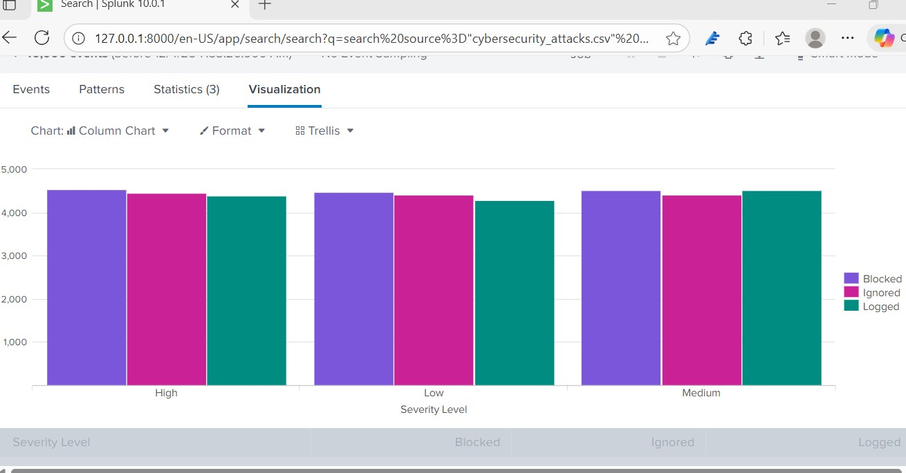
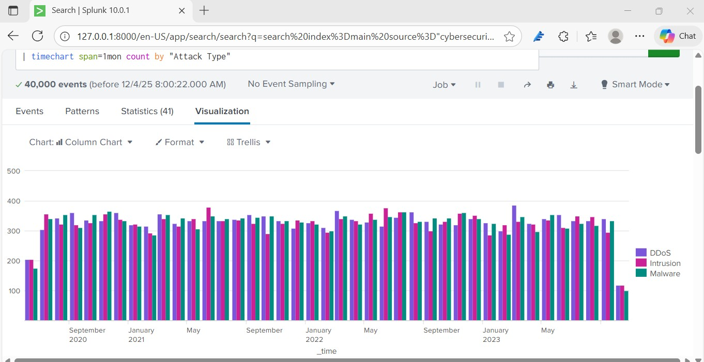
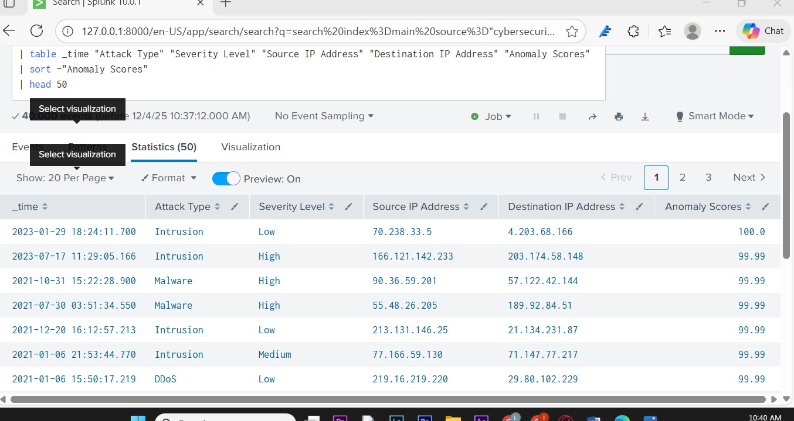

# 🛡️ Cyber Security Analysis — Threat Detection with Splunk

[](https://www.splunk.com)
[](https://python.org)
[](https://www.kaggle.com)
[](https://github.com/Lucas-GCamargo/Splunk-SOC-Analysis)

> **A Splunk Enterprise security analysis project that ingests 40,000 synthetic cyber-attack events, builds a three-panel SOC-style dashboard, detects a critical firewall policy failure, identifies persistent attack trends, and surfaces the 50 highest-risk anomalies — with a fully automated Python ingestion pipeline.**

---

## ⚠️ Ethical Use Disclaimer

**This project was built strictly for educational and authorised security analysis purposes.**

- All data used is synthetic — sourced from a public Kaggle research dataset
- No real systems, users, or networks were targeted or monitored
- The SPL queries and automation pipeline demonstrated here must only be applied to environments you own or have explicit written authorisation to audit
- Unauthorised access to computer systems is illegal under the **Australian Criminal Code Act 1995 (Cth) — s477.1**

---

## 📌 The Security Problem

Security Operations Centres (SOCs) generate thousands of log events per hour. Without structured analysis, critical threats — such as firewall misconfigurations, undetected intrusions, and high-severity attacks passing through unblocked — remain invisible until damage is done.

This project simulates the analyst workflow: ingest raw event data into Splunk, write targeted SPL queries to surface threats, build a dashboard that gives the client a live picture of their security posture, and automate the pipeline so dashboards update without manual intervention.

**Real-world context:** The dataset contains 40,000 synthetic cyber-attack events spanning attack types, severity levels, firewall responses, and anomaly scores — the same categories a SOC analyst encounters when triaging real network telemetry. The key finding — High-Severity attacks passing through the firewall as "Ignored" — is a realistic misconfiguration present in production environments.

---

## 🔍 How It Works

```text
── PHASE 1: Analysis (manual, completed) ───────────────────────
Kaggle Dataset (CSV)
        ↓
Manual upload to Splunk → index=security, sourcetype=cyber_attack (Settings → Add Data)
        ↓
SPL Queries (queries.spl) → 3-panel dashboard in Splunk Search & Reporting
        ↓
Findings: Firewall failure | Persistent threats | Anomalies

── PHASE 2: Automation (splunk_ingest.py) ──────────────────────
CSV data source
        ↓
splunk_ingest.py polls every 5 min → converts events to JSON
        ↓
HTTP Event Collector (HEC) → Splunk index=security
        ↓
Dashboards update automatically → no manual uploads required
        ↓
Splunk Alerts → email or ticket when thresholds exceeded
```
> Phase 1 was completed manually to perform the initial analysis and build the dashboard. Phase 2 (`splunk_ingest.py`) is a lab ingestion prototype — built to demonstrate how a production pipeline would keep the dashboard continuously updated — eliminating the need for manual CSV uploads.

---

## 📁 Project Structure

```
Splunk-SOC-Analysis/
│
├── splunk_ingest.py               ← Python automation pipeline (CSV → Splunk HEC)
├── queries.spl                    ← All SPL queries — ready to paste into Splunk
├── Threat_Detection_Dashboard.pdf ← Presentation: dashboard screenshots & findings
├── screenshot_firewall.jpg        ← Splunk dashboard output: firewall policy audit
├── screenshot_trends.jpg          ← Splunk dashboard output: monthly attack trend
├── screenshot_anomaly.jpg         ← Splunk dashboard output: top 50 anomalies
├── .gitignore                     ← Excludes credentials, logs, and cache files
│
└── README.md                      ← Project documentation (you are here)
```

> **All dashboard screenshots below are real Splunk outputs** — captured from a live Splunk Enterprise 10.0.1 instance running the Kaggle Cyber Security Attacks dataset (40,000 events).

---

## 📊 Dashboard — 3 Panels

All SPL queries are also available as a standalone file: [`queries.spl`](queries.spl)

Dataset fields: `Timestamp`, `Source IP Address`, `Destination IP Address`, `Attack Type`, `Severity Level`, `Anomaly Scores`, `Firewall Rules`, `Action Taken`.

### Panel 1 — Firewall Policy Audit
Column chart showing how the firewall responded (`Blocked`, `Ignored`, `Logged`) across severity levels — reveals that High-severity attacks were being ignored instead of blocked.

```spl
index=security sourcetype=cyber_attack
| stats count by "Severity Level" "Action Taken"
| sort - count
```

---

### Panel 2 — Monthly Attack Trend
Column chart showing DDoS, Intrusion, and Malware event volumes month by month — confirms a persistent, stable threat landscape rather than isolated spikes.

```spl
index=security sourcetype=cyber_attack
| timechart span=1mon count by "Attack Type"
```

---

### Panel 3 — Top 50 Highest-Risk Anomalies
Statistics table sorted by Anomaly Scores descending — the 50 events with scores closest to 100 represent behaviour furthest from normal patterns and are the highest-priority items for analyst review.

```spl
index=security sourcetype=cyber_attack
| table _time "Attack Type" "Severity Level" "Source IP Address" "Destination IP Address" "Anomaly Scores"
| sort -"Anomaly Scores"
| head 50
```

---

## 🚨 Key Findings

### 1 — Firewall Policy Failure (Critical)
Analysis of how the firewall responded across severity levels revealed a critical misconfiguration: **High-Severity attacks were being ignored instead of blocked**. This indicates either a policy gap or a configuration error in the IPS/firewall ruleset, leaving the most dangerous traffic unmitigated.

**Recommendation:** Review and update firewall/IPS rules so all High-severity events trigger an automatic block and generate an alert — currently they are being ignored at the same rate they are blocked.


*Splunk output: High-severity attacks being ignored instead of blocked — a critical firewall misconfiguration*

---

### 2 — Persistent Attack Landscape
DDoS, Intrusion, and Malware event types appear at **stable levels every single month** — there are no isolated spikes, only a constant background threat. This pattern means one-off investigations are insufficient; continuous monitoring is required.

**Recommendation:** Implement always-on dashboards with rolling 24-hour and 7-day views, and configure automated alerts for volume deviations from the monthly baseline.


*Splunk output: DDoS, Intrusion, and Malware events at stable levels every month from 2020–2023 across all 40,000 events*

---

### 3 — High-Risk Anomalies Identified
The **top 50 events by Anomaly Scores** (scores approaching 100) represent behaviour far outside normal patterns — unusual payload sizes, unexpected port access, or abnormal traffic timing. These are the highest-priority events for forensic investigation.

**Recommendation:** Use anomaly scores as a triage filter. Route all events scoring above a defined threshold directly to Level 2 analysts for immediate review.


*Splunk output: Top 50 highest-risk events sorted by Anomaly Scores — scores of 99.99–100.0 indicate behaviour far outside normal patterns*

---

## ⚡ Automation Pipeline — splunk_ingest.py

The [`splunk_ingest.py`](splunk_ingest.py) script automates data delivery into Splunk, eliminating manual CSV uploads.

| Step | Function | Detail |
|---|---|---|
| **1. Collect** | `load_events_from_csv()` | Filters by timestamp — only loads events newer than the last successful run |
| **2. Deduplicate** | `filter_new_events()` | Chronologically bounded SHA-256 hash list prevents re-sending on restart |
| **3. Format** | `format_for_hec()` | Wraps events in Splunk HEC JSON envelope with epoch timestamp |
| **4. Ingest** | `send_to_hec()` | Batch sends to HEC endpoint (HTTP or HTTPS) — handles errors gracefully |
| **5. Persist** | `save_state()` | Saves last timestamp and event hashes for crash recovery |
| **6. Orchestrate** | `run_once()` | Runs steps 1–5 as a single cycle; returns updated state |
| **7. Loop** | `run_continuous()` | Calls `run_once()` every 5 minutes — runs indefinitely until interrupted |

**Quick start:**

```bash
# 1. Set your HEC token and Splunk host
export SPLUNK_HEC_TOKEN="your-token-here"
# Also update SPLUNK_HOST in splunk_ingest.py (default is "localhost")
# and set SPLUNK_USE_HTTPS=true if your instance uses HTTPS

# 2. Run a single demo cycle
python3 splunk_ingest.py

# 3. Run continuous ingestion (polls every 5 minutes)
python3 splunk_ingest.py --continuous
```

**Requirements:** Python 3.7 or higher — uses standard library only (`json`, `os`, `sys`, `time`, `csv`, `logging`, `hashlib`, `datetime`, `random`, `urllib`)

---

## 🛠️ Technical Concepts Demonstrated

| Concept | Implementation |
|---|---|
| **SPL (Search Processing Language)** | SOC-style SPL queries covering aggregation, time-series analysis, anomaly detection, data cleaning, and alerting |
| **Field Name Handling** | Kaggle dataset fields contain spaces (`"Attack Type"`, `"Severity Level"`) — double-quote notation used in `stats`, `sort`, `table`, `timechart`; single-quote notation required in `\| where` (double quotes in `where` are string literals, not field references) |
| **Data Cleaning** | `where isnotnull()` and field filtering drop missing values and reduce noise before analysis |
| **HTTP Event Collector (HEC)** | JSON-formatted events sent programmatically into Splunk without file uploads |
| **Duplicate Detection** | Truncated SHA-256 (16-char prefix) with ordered insertion list prevents re-ingestion and removes oldest hashes first |
| **State Persistence** | JSON state file tracks last timestamp and ingested hashes for crash recovery |
| **Error Handling** | HTTP 403/400 errors caught with specific diagnostic messages; graceful `KeyboardInterrupt` exit |

---

## 💡 Security Insights

### Data Cleaning in Splunk

The Kaggle dataset contains rows where fields like `Severity Level` are missing or empty. Filtering these out before analysis prevents them from distorting counts:

```spl
index=security sourcetype=cyber_attack
| where isnotnull('Severity Level') AND 'Severity Level'!=""
| fields _time "Source IP Address" "Destination IP Address" "Attack Type" "Severity Level" "Anomaly Scores"
```

`where isnotnull('Severity Level')` drops records with missing severity — note the **single quotes** around `Severity Level`. In Splunk's `where` command, field names that contain spaces must use single quotes; double quotes are treated as string literals and the filter would silently match nothing. `fields` removes irrelevant columns — transforming the raw ingest into a structured, analysis-ready dataset.

---

### Recommended Automated Alerts

| Alert | SPL Trigger Condition | Reason |
|---|---|---|
| High-severity spike | Count > 50 in 10 min window | Sustained targeted attack in progress |
| Single attack type dominance | One type > 80% of events in 10 min | Focused campaign — DDoS or intrusion wave |
| Anomaly score surge | Average anomaly score > 85 in 10 min | Unusual payload or traffic pattern |
| New attack type appears | Type not seen in prior 24 hours | Novel threat vector requiring immediate review |

---

### Feature Engineering — Additional Data Points

Two data points not present in the current dataset that would strengthen the dashboard:

**1. IP Reputation / Threat Score** — Cross-referencing attacking IPs against threat-intelligence feeds (AbuseIPDB, VirusTotal) separates opportunistic bots from known threat actors, allowing analysts to prioritise response.

**2. Geographic Origin / ASN Data** — Cross-referencing attacking IPs against geolocation and Autonomous System Number (ASN) data would identify whether attacks originate from known cloud providers, residential IPs, or hosting infrastructure — helping analysts distinguish automated scanners from targeted intrusions.

---

## ⚠️ Limitations

**1. No collision guarantee in event deduplication**
`splunk_ingest.py` uses the first 16 characters of a SHA-256 digest as a deduplication key. While collisions are extremely unlikely in practice, two different events could theoretically produce the same 16-character prefix and one would be silently skipped. A production-grade implementation would use the full 64-character digest. Additionally, the hash list is capped at 10,000 entries (oldest removed first) — events older than the 10,000th most recent hash will not be deduplicated if re-encountered.

**2. Synthetic dataset**
The Kaggle dataset is realistic but not real. Production environments will have different distributions and log formats.

**3. No cross-source correlation**
Each SPL query analyses the Kaggle dataset in isolation. A production SOC dashboard would correlate cyber attack events with network flow logs, endpoint telemetry, and threat-intelligence feeds to link related events across data sources and build a fuller picture of each incident.

**4. Single-threaded ingestion**
`splunk_ingest.py` runs on a single thread. For high-volume production use, a multiprocessing approach with a message queue (e.g. Kafka) would be appropriate.

---

## ⚙️ Setup & Usage

**Requirements:**
- Splunk Enterprise (free trial or licensed) — HEC must be enabled on port `8088` (Settings → Data Inputs → HTTP Event Collector)
- Python 3.7 or higher (for `splunk_ingest.py`) — `datetime.fromisoformat()` requires 3.7+
- Dataset: [Kaggle — Cyber Security Attacks](https://www.kaggle.com/datasets/teamincribo/cyber-security-attacks)

```bash
# 1. Clone the repository
git clone https://github.com/Lucas-GCamargo/Splunk-SOC-Analysis

# 2. Navigate into the folder
cd Splunk-SOC-Analysis

# 3. Upload the Kaggle CSV to Splunk
#    Settings → Add Data → Upload → set index=security, sourcetype=cyber_attack
#    (sourcetype must match exactly — all queries filter on sourcetype=cyber_attack)

# 4. Open Splunk Search & Reporting
#    Copy ONLY the SPL lines from queries.spl (no # comment lines)
#    and paste into the search bar

# 5. (Optional) Run the ingestion pipeline
#    Linux/macOS:
export SPLUNK_HEC_TOKEN="your-token-here"
#    Windows (Command Prompt):
#    set SPLUNK_HEC_TOKEN=your-token-here
#    Save the Kaggle CSV as security_events.csv in the same folder, then:
python3 splunk_ingest.py
```

---

## 🧠 What I Learned

**1. SPL is a purpose-built security language**
Writing targeted queries to aggregate attack types over time with `timechart`, sort 40,000 events by anomaly scores with a single `sort` command, and expose a firewall misconfiguration with a two-field `stats` — all without writing a single line of Python — made the power of SPL concrete. It is not just a query language; it is a full analytical pipeline from raw ingested data to actionable finding in a single command chain.

**2. Firewalls can fail silently**
The most significant finding — High-Severity attacks passing through unblocked — would not be visible without structured analysis. The data was there; the failure was invisible until the right query was written. This reinforced why dashboards and regular audits are not optional.

**3. Continuous threats require continuous monitoring**
Discovering that DDoS, Intrusion, and Malware events appeared every single month at stable levels changed how I think about security posture. A one-time audit is insufficient; the architecture must assume constant threat presence.

**4. Automation is not a feature — it is a requirement**
Manual CSV uploads mean the dashboard is always out of date. Building the Python → HEC ingestion pipeline made clear that real-time security visibility requires removing humans from the data delivery loop entirely.

**5. Anomaly scores are a triage tool**
Ranking events by Anomaly Scores and focusing on the top 50 demonstrated the practical value of feature engineering in security analytics. Without a scoring mechanism, a SOC analyst has no principled way to decide which of 40,000 events deserves immediate attention.

---

## 🔗 References

- [Splunk SPL Documentation](https://docs.splunk.com/Documentation/Splunk/latest/SearchReference/WhatsInThisManual)
- [Splunk HTTP Event Collector (HEC)](https://docs.splunk.com/Documentation/Splunk/latest/Data/UsetheHTTPEventCollector)
- [Kaggle — Cyber Security Attacks Dataset](https://www.kaggle.com/datasets/teamincribo/cyber-security-attacks)
- [OWASP Attack Classification](https://owasp.org/www-community/attacks/)
- [Australian Cyber Security Centre](https://www.cyber.gov.au)
- [NIST Cybersecurity Framework](https://www.nist.gov/cyberframework)

---

## 🤝 Let's Connect

I am a cybersecurity analyst building a strong technical foundation in SIEM analysis, threat detection, and security automation.

- 📧 [lucascamargo@outlook.com.au](mailto:lucascamargo@outlook.com.au)
- 🔗 [linkedin.com/in/lucasgcamargo](https://www.linkedin.com/in/lucasgcamargo)

---

## © Copyright

© 2026 Lucas Camargo. All Rights Reserved.
This project is for educational and portfolio purposes. The author accepts no responsibility for misuse.
